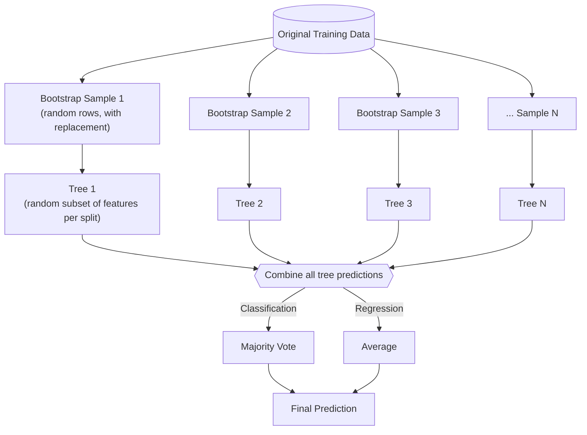
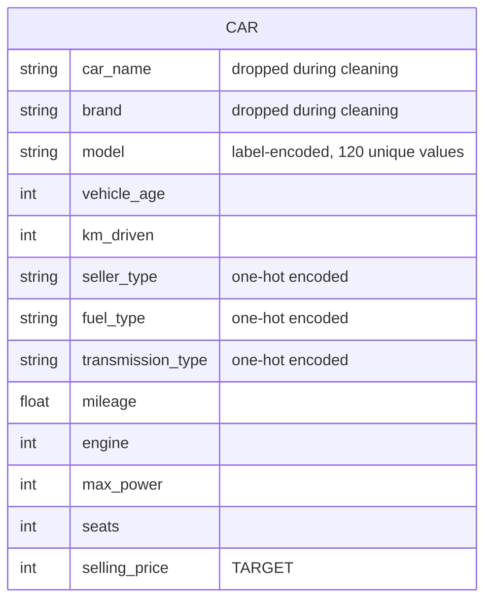
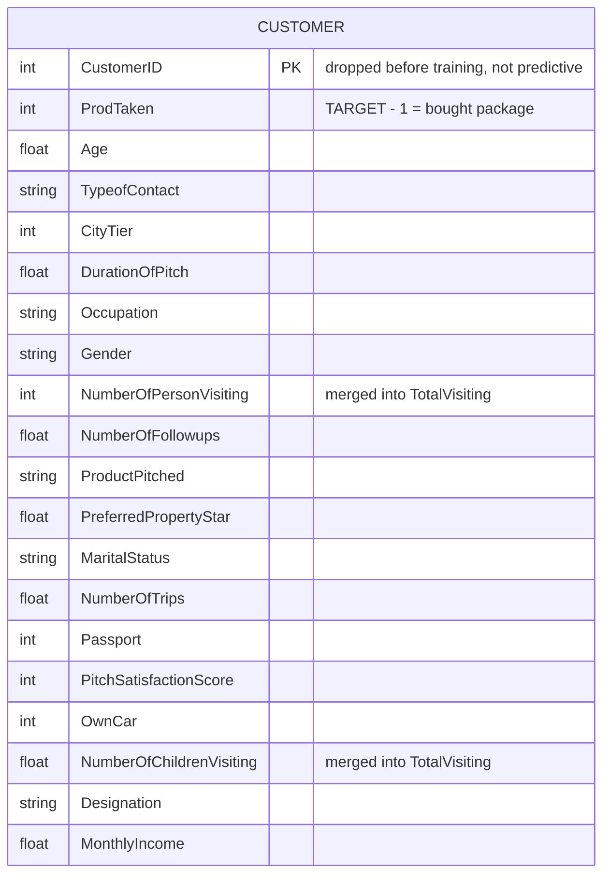
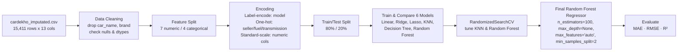

# Random Forest Project

Two end-to-end ML pipelines built around the same core algorithm — **Random Forest** — applied to two different kinds of problems:

1. **Regression** → predict the resale price of a used car
2. **Classification** → predict whether a customer will buy a holiday package

This README is written so that if you (future you 👋) come back to this repo after months, you can re-read it once and remember *why* Random Forest works, *what* was done, and *how* to run it again.

---

## 📁 Repo Structure

```
Random-Forest-Project/
│
├── Notebooks/
│   ├── Random_Forest_Regression_Implementation.ipynb      # Used Car Price Prediction
│   └── Random_Forest_Classification_Implementation.ipynb  # Holiday Package Prediction
│
├── Data/
│   ├── cardekho_imputated.csv    # used for the regression notebook
│   └── Travel.csv                # used for the classification notebook
│
└── README.md
```

> ⚠️ **Path note:** inside the notebooks, the data is read as `./data/cardekho_imputated.csv` and `Travel.csv` (relative to wherever the notebook is running). Since `Notebooks/` and `Data/` are siblings in this repo, when you open a notebook from the `Notebooks/` folder, update the read path to `../Data/cardekho_imputated.csv` and `../Data/Travel.csv` — otherwise you'll get a `FileNotFoundError`.

---

## 🧠 The Theory — explained like you're seeing it for the first time

### 1. It all starts with a Decision Tree
A Decision Tree asks a series of yes/no questions about your data ("Is `vehicle_age` < 5?", "Is `Age` > 40?") and keeps splitting the data until it reaches a decision. It's easy to understand, but a **single** tree has a big problem: it **overfits**. It memorizes the training data's noise instead of learning the general pattern, so it performs great on training data and poorly on new data.

### 2. Ensemble Learning — don't trust one opinion, trust many
Instead of relying on one model, train **many** models and combine their answers. The idea: individual models make different mistakes, but those mistakes tend to cancel out when averaged/voted, while the real signal they all agree on stays. Random Forest is one specific way of doing this.

### 3. Bagging (Bootstrap **Agg**regat**ing**)
This is the "many opinions" trick, applied to trees:

- **Bootstrap** = create many random samples from your training data, **with replacement** (so the same row can appear more than once in a sample, and some rows may not appear at all).
- **Aggregating** = train one tree per sample, then combine all their predictions at the end.

Think of it like asking 100 different friends to estimate a used car's price, but each friend only gets to see a random, overlapping subset of past sale records. No single friend is reliable, but their **combined** estimate is usually very close to the truth, because individual errors wash out.

### 4. Random Forest = Bagging + one extra trick
Bagged trees are still fairly similar to each other because they all get to look at every column. Random Forest adds one more layer of randomness: **at every split, each tree is only allowed to consider a random subset of features**, not all of them. This forces the trees to be less correlated with each other — some trees are forced to discover patterns using features they'd otherwise ignore. Less-correlated trees average out to a better, more stable final answer.

So: **Random Forest = Bootstrap sampling of rows + Random subset of features at each split + Many Decision Trees + Aggregation.**

### 5. How the forest gives one final answer
| | How each tree votes | How the forest combines them |
|---|---|---|
| **Classification** (e.g., will buy? yes/no) | Each tree predicts a class | **Majority vote** — the class most trees picked wins |
| **Regression** (e.g., predict a price) | Each tree predicts a number | **Average** — mean of all trees' predicted numbers |

### 6. Key hyperparameters you'll see tuned in both notebooks
- **`n_estimators`** — how many trees are in the forest. More trees = generally more stable, but slower.
- **`max_depth`** — how deep each tree is allowed to grow. Deeper = can capture more complex patterns, but risks overfitting.
- **`max_features`** — how many features each tree is allowed to consider at a split. This is the "randomness" knob described above.
- **`min_samples_split`** — the minimum number of rows a node needs before it's allowed to split further. Higher = simpler, more conservative trees.

### 7. Why bother with all this?
A single Decision Tree = low bias, high variance (overfits).
A Random Forest = keeps the low bias, but drags the variance way down by averaging many decorrelated trees. That's the whole point — it's one of the best "accuracy for effort" algorithms for tabular data, works out of the box with very little tuning, handles non-linear relationships, and doesn't need feature scaling to work (though we still scale here for the other models we compare against).

Visually, this is what happens to your data inside the forest:



---

## 🗂️ Datasets — ER Diagrams

Both datasets are flat, single-table CSVs (no foreign keys, no joins) — so each "ER diagram" below is really just **one entity with its attributes**, shown this way so the schema is easy to scan at a glance.

### `cardekho_imputated.csv` — 15,411 rows × 13 columns



### `Travel.csv` — 4,888 rows × 20 columns



---

## 📓 Notebook 1 — `Random_Forest_Regression_Implementation.ipynb`
### Used Car Price Prediction

**Goal:** predict a used car's `selling_price` from its specs, so a seller on CarDekho can get a fair market price suggestion.



**What was actually done, step by step:**
1. Loaded the CSV, dropped `car_name` and `brand` (too granular / redundant with `model`).
2. Checked for nulls (none) and split columns into numeric vs. categorical, discrete vs. continuous.
3. `model` has 120 unique values → **Label Encoded** (one-hot would create too many columns). `seller_type`, `fuel_type`, `transmission_type` have few categories → **One-Hot Encoded**. Remaining numeric columns → **Standard Scaled**.
4. 80/20 train-test split.
5. Trained and compared 6 regressors as a baseline.
6. Ran `RandomizedSearchCV` (3-fold CV, 100 iterations) to tune Random Forest and KNN.
7. Retrained Random Forest with the best-found parameters and evaluated it.

**Results:**

| Model | Test RMSE | Test MAE | Test R² |
|---|---|---|---|
| Linear Regression (baseline) | 502,543.59 | 279,618.58 | 0.6645 |
| **Random Forest (tuned)** | **228,415.20** | **102,398.21** | **0.9307** |

The tuned Random Forest explains ~93% of the variance in car prices on unseen data, a big jump over plain Linear Regression. Training R² (0.9792) is a bit higher than test R² (0.9307) — a normal, mild sign that the trees still fit some training noise, but not enough to call it a problem.

---

## 📓 Notebook 2 — `Random_Forest_Classification_Implementation.ipynb`
### Holiday Package Prediction

**Goal:** for "Trips & Travel.Com," predict which customers are likely to buy the new **Wellness Tourism Package** (`ProdTaken` = 1), so marketing spend can target likely buyers instead of contacting people at random.

```mermaid
flowchart LR
    A["Travel.csv<br/>4,888 rows x 20 cols"] --> B["Data Cleaning<br/>fix 'Fe Male' -> Female,<br/>'Single' -> Unmarried<br/>impute missing (median/mode)"]
    B --> C["Drop CustomerID"]
    C --> D["Feature Engineering<br/>TotalVisiting = NumberOfPersonVisiting<br/>+ NumberOfChildrenVisiting"]
    D --> E["Encoding<br/>One-hot categorical cols<br/>Standard-scale numeric cols"]
    E --> F["Train/Test Split<br/>80% / 20%"]
    F --> G["Train & Compare 4 Models<br/>Logistic Regression, Decision Tree,<br/>Random Forest, Gradient Boosting"]
    G --> H["RandomizedSearchCV<br/>tune Random Forest"]
    H --> I["Final Random Forest Classifier<br/>n_estimators=1000, max_features=7,<br/>max_depth=None, min_samples_split=2"]
    I --> J["Evaluate<br/>Accuracy · F1 · Precision · Recall · ROC-AUC"]
```



**What was actually done, step by step:**
1. Loaded `Travel.csv`, fixed inconsistent category labels (`"Fe Male"` → `"Female"`, `"Single"` → `"Unmarried"`).
2. Imputed missing values — **median** for skew-prone numeric columns (`Age`, `DurationOfPitch`, `NumberOfTrips`, `MonthlyIncome`), **mode** for count-like/discrete columns (`TypeofContact`, `NumberOfFollowups`, `PreferredPropertyStar`, `NumberOfChildrenVisiting`).
3. Dropped `CustomerID` (just an ID, not predictive).
4. **Feature engineering**: combined `NumberOfPersonVisiting` + `NumberOfChildrenVisiting` into one `TotalVisiting` column.
5. One-hot encoded categorical columns, standard-scaled numeric columns.
6. 80/20 train-test split.
7. Trained and compared 4 classifiers as a baseline.
8. Ran `RandomizedSearchCV` (3-fold CV, 100 iterations) to tune Random Forest.
9. Retrained Random Forest with the best parameters, evaluated it, and plotted the ROC curve.

**Results:**

| Model | Test Accuracy | Test F1 | Test Precision | Test Recall | Test ROC-AUC |
|---|---|---|---|---|---|
| Logistic Regression (baseline) | 0.8354 | 0.8078 | 0.6829 | 0.2932 | 0.6301 |
| **Random Forest (tuned)** | **0.9315** | **0.9265** | **0.9697** | **0.6702** | **0.8325** |

**Read this like a teacher would explain it back to you:**
- Random Forest crushes Logistic Regression on every metric, especially **Recall** (0.29 → 0.67) — it catches over twice as many real buyers.
- **Training accuracy hit 1.0000 (100%)** for the tuned model. That's a textbook overfitting signal — the forest has essentially memorized the training set. Test performance (93% accuracy) is still strong, so it's not a disaster, but it means the model is more confident than it should be, and a slightly shallower forest (lower `max_depth`, higher `min_samples_split`) would likely generalize just as well with less overfitting risk.
- **Precision (0.97) >> Recall (0.67)**: when the model says "this person will buy," it's right 97% of the time — but it still misses about a third of actual buyers. For a marketing use-case that's usually an acceptable trade-off (you don't waste money on false leads), but worth knowing before you ship it.

---

## 🛠️ Tech Stack

```
pandas, numpy                     → data handling
matplotlib, seaborn, plotly       → visualization
scikit-learn                      → preprocessing, models, RandomizedSearchCV, metrics
```

## ▶️ How to Run

```bash
git clone <this-repo-url>
cd Random-Forest-Project
pip install pandas numpy matplotlib seaborn plotly scikit-learn jupyter

jupyter notebook
# open Notebooks/Random_Forest_Regression_Implementation.ipynb
#   -> update the CSV path to ../Data/cardekho_imputated.csv
# open Notebooks/Random_Forest_Classification_Implementation.ipynb
#   -> update the CSV path to ../Data/Travel.csv
```

---

## 🎯 TL;DR for future-me

- **Random Forest** = a bunch of Decision Trees, each trained on a random bootstrap sample of rows and a random subset of features at every split, whose predictions are then averaged (regression) or voted on (classification).
- It beats a single tree because averaging many *decorrelated* weak learners cancels out individual overfitting.
- Notebook 1 (regression) → tuned Random Forest gets **R² = 0.93** predicting used car prices, big upgrade over Linear Regression's 0.66.
- Notebook 2 (classification) → tuned Random Forest gets **93% accuracy / 0.83 ROC-AUC** predicting holiday package buyers, but shows signs of overfitting (100% train accuracy) — a shallower forest is worth trying next time.
